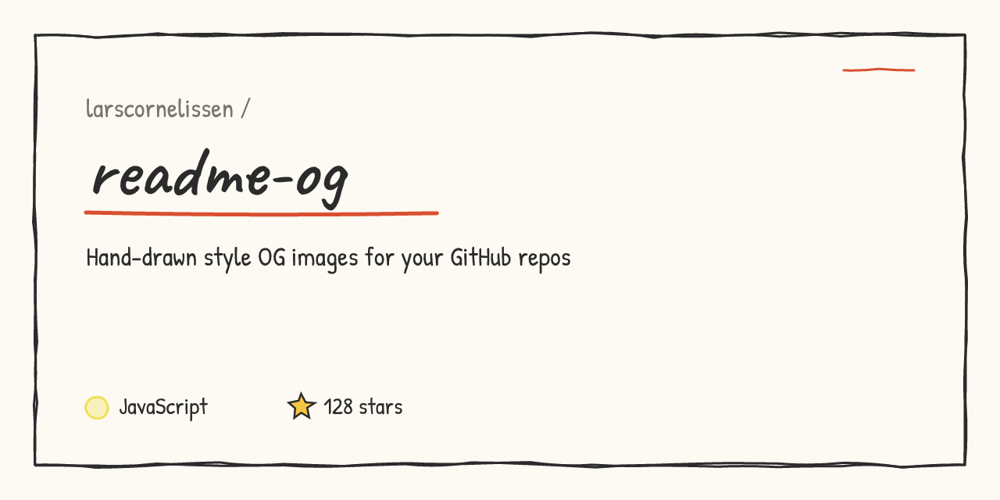

# readme-og ✏️

> Hand-drawn style Open Graph / social-preview images for your GitHub repos — pure SVG, rendered to PNG, zero config.



Think xkcd-graph aesthetics: wobbly double-stroke borders, marker-pen underlines, a sketchy star for your star count, and handwritten fonts (Caveat + Patrick Hand). The wobble is seeded by your repo name, so the same repo always renders the same sketch.

## Quick start

```bash
# Generate an SVG (fills description/language/stars from the GitHub API)
node src/cli.js --repo owner/name --fetch --out og.svg

# Or specify everything yourself
node src/cli.js --repo octocat/hello-world \
  --description "My first repository on GitHub!" \
  --language JavaScript --stars 2547 \
  --theme paper --out og.svg

# Render to PNG (GitHub's social preview upload needs a raster image)
node scripts/render-png.js og.svg og.png
```

### Options

| Flag | Description | Default |
|------|-------------|---------|
| `-r, --repo` | Repo slug, e.g. `octocat/hello-world` | required |
| `-d, --description` | Description text | — |
| `-l, --language` | Primary language (colored dot) | — |
| `-s, --stars` | Star count | — |
| `-t, --theme` | `paper` \| `dark` \| `blueprint` | `paper` |
| `-o, --out` | Output file | `og.svg` |
| `--fetch` | Fill missing fields from the GitHub API | off |

## Make it your repo's social preview

The PNG doesn't become your social preview automatically — GitHub has no API for this, it's a one-time manual step:

1. Go to your repo → **Settings** → **General** → **Social preview**
2. Upload `assets/og.png` (1280×640, exactly what this tool outputs)

From then on, sharing your repo link on WhatsApp, Discord, Slack, X, LinkedIn, iMessage, etc. shows your hand-drawn card instead of GitHub's default auto-generated image.

## How it works

- No image libraries for the artwork — the sketchy look is hand-rolled SVG paths ([src/rough.js](src/rough.js)): jittered quadratic segments, double-stroked rectangles, wobbly underlines.
- Deterministic: a tiny seeded PRNG keyed on `repo + theme` means no diff noise when regenerating.
- PNG rendering uses [resvg-js](https://github.com/thx/resvg-js); fonts are downloaded once and cached in `.fonts/`.
- Output is 1280×640, GitHub's recommended social preview size (2:1 ratio, also ideal for X/Discord large cards).

## Themes

`paper` (default, warm off-white + red marker) · `dark` (charcoal + yellow marker) · `blueprint` (navy + cyan chalk)

## License

MIT

---

⭐ If this made your repo prettier, a star helps others find it.
